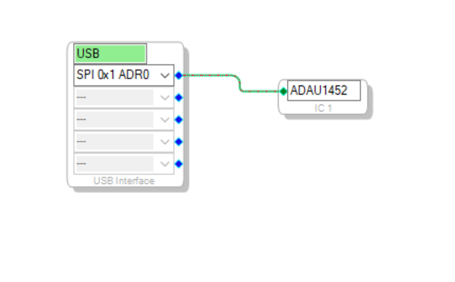

# RP2040 USBi Rust Reimplementation

This is an implementation of the Analog Devices USBi interface (EVAL-ADUSB2EBZ) which can work on a low cost RP2040 microcontroller

It has been tested to work with SigmaStudio in the same way as the official Cypress-based interface

Only SPI is supported with the following pinout:

- CLK: 10
- MOSI: 11
- MISO: 12
- SS: 13
- status led: 25

# Build / Run

Run `cargo run --release` in the project's root directory (with JTAG)

Look in `.cargo/config.toml` if you don't have a JTAG adapter